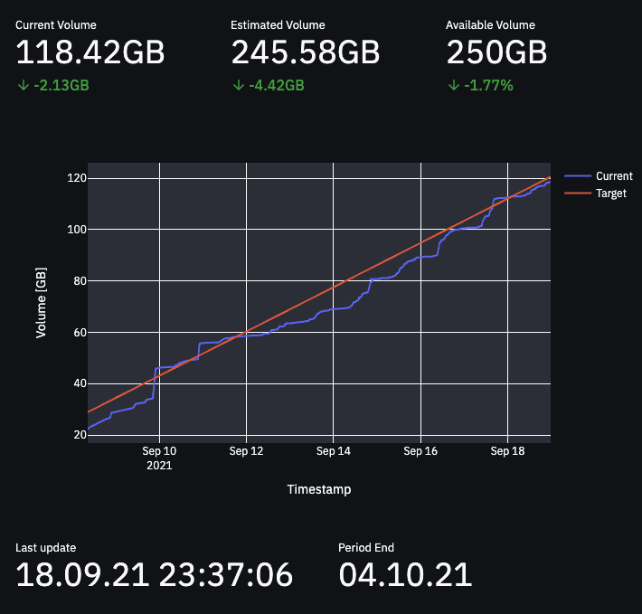

# Gigacube analyser
Simple analyzing tools to monitor network traffic volume for Vodafone's Giga Cube

## Content
### **dashboard**
Simple streamlit dashboard to monitor current volume, estimated volume etc. Here is an
screenshot of it: .

### **scraper**
Simple website scraper which extracts the current volume, target volume etc. from
the Giga Cube's homepage.

### **server**
Detailed information on how to set up a server to run the applications on.
